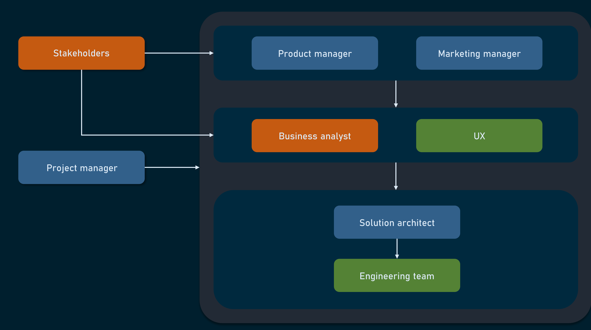

Business analysis is a professional discipline of identifying business needs and determining solutions to business problems. Solutions often include a software-systems development component, but may also consist of process improvements, organizational change or strategic planning and policy development.

A business analyst is a member of a product development team who analyzes the business domain, documents its processes and systems, outlines business requirements, and matches a software business model with the software being built.

At all development stages, a business analyst communicates with stakeholders, and product and marketing managers to capture business- and market-level requirements and then interacts with developers through a project manager, without a direct impact on the development process.