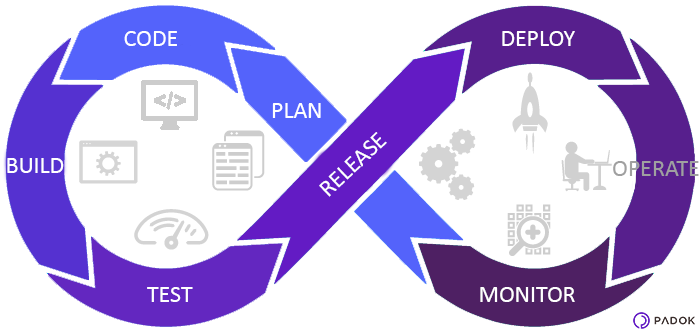

# Introduction

The concept of DevOps allows the Development and Operations teams to work together in a collaborative or shared manner which results in a constant and seamless communication amongst the team members.

# Why DevOps is Beneficial For Us?

* Collaboration & Trust - Lack of visibility and shared goals means lack of dependency planning, misaligned priorities, finger pointing, and “not our problem” mentality, resulting in slower velocity and substandard quality. DevOps is that change in mindset of looking at the development process holistically and breaking down the barrier between development and operations.
* Release faster and work smarter - Teams that practice DevOps release deliverables more frequently, with higher quality and stability. 
* Accelerate time-to-resolution - Full transparency and seamless communication enables teams to minimize downtime and resolve issues faster.
* Better manage unplanned work - With established processes and clear prioritization, development and operations teams can better manage unplanned work while continuing to focus on planned work.

We encourage engineering teams to make an upfront investment during Sprint 0 of a project to establish an automated and repeatable pipeline which continuously integrates code and releases system executable(s) to target cloud environments. Each integration should be verified by an automated build process to surface any errors across the developer team.

We encourage teams to implement the CI/CD pipelines before any service code is written for customers, which usually happens in Sprint 0(N). This way, the engineering team can develop and test their work in isolation without impacting other developers and promote a consistent devops workflow throughout the engagement.

The following image illustrates the steps of the CI/CD process:

1. **Plan** - This stage is where you organize the tasks, schedules as well as set up the project management tools.Requirements and feedback are gathered from stakeholders and customers and used to build a product roadmap to guide future development. The product roadmap can be recorded and tracked using a ticket management system such as Jira, Trello etc

2. **Code** - This stage is where the development actually takes place.In addition to the standard toolkit of a software developer, the team can have a standard set of plugins installed in their development environments to aid the development process, help enforce consistent code-styling and avoid common security flaws and code anti-patterns.

3. **Build** - The Build phase is where DevOps really kicks in.The expected goal of this stage is to build the source code into one desired format, compiling, testing and deploying in a particular place of the infrastructure.Once a developer has finished a task, they commit their code to a shared code repository. There are many ways this can be done, but typically the developer submits a pull request — a request to merge their new code with the shared codebase. Another developer then reviews the changes they’ve made, and once they’re happy there are no issues, they approve the pull-request. This manual review is supposed to be quick and lightweight, but it is effective at identifying issues early.
Simultaneously, the pull request triggers an automated process which builds the codebase and runs a series of end-to-end, integration and unit tests to identify any regressions. If the build fails, or any of the tests fail, the pull-request fails and the developer is notified to resolve the issue. 

4. **Test** -  The continuous testing process reduces risks. Manual as well as automated tests ensure that no bugs will be implemented in production. You have to implement testing tools in your workflow to ensure the best development quality for your software.

5. **Release** - This is the stage at which we say a build is ready for deployment into the production environment. By this stage, each code change has passed a series of manual and automated tests, and the operations team can be confident that breaking issues and regressions are unlikely.

6. **Deploy** - Finally, a build is ready for the big time and it is released into production. There are several tools and processes that can automate the release process to make releases reliable with no outage window. Also there are multiple deployment strategies that can be adopted depending on our requirements.
For example, a blue-green deployment approach will allow to switch to the new production environment with practically no downtime.

7. **Operate** - The team maintains a scalable infrastructure, infrastructure as code and check security issues and log management.

8. **Monitor** - The final phase of the DevOps process is to monitor the environment to ensure that there are no bottlenecks in the pipelines affecting the productivity of the team.