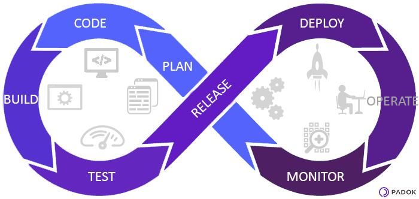

# CI/CD

**Continuous Integration(CI)** is the engineering practice of frequently committing code in a shared repository, ideally several times a day, and performing an automated build on it. These changes are built with other simultaneous changes to the system, which enables early detection of integration issues between multiple developers working on a project. Build breaks due to integration failures are treated as the highest priority issue for all the developers on a team and generally work stops until they are fixed.

**Continuous Delivery(CD)** takes the Continuous Integration concept further to also test deployments of the integrated code base on a replica of the environment it will be ultimately deployed on. This enables us to learn early about any unforeseen operational issues that arise from our changes as quickly as possible and also learn about gaps in our test coverage.

The goal of all of this is to ensure that the main branch is always shippable, meaning that we could, if we needed to, take a build from the main branch of our code base and ship it on production.

The following image illustrates the steps of the CI/CD process:

1. **Plan** - This stage is where you organize the tasks, schedules as well as set up the project management tools.Requirements and feedback are gathered from stakeholders and customers and used to build a product roadmap to guide future development. The product roadmap can be recorded and tracked using a ticket management system such as Jira, Trello etc

2. **Code** - This stage is where the development actually takes place.In addition to the standard toolkit of a software developer, the team can have a standard set of plugins installed in their development environments to aid the development process, help enforce consistent code-styling and avoid common security flaws and code anti-patterns.

3. **Build** - The Build phase is where DevOps really kicks in.The expected goal of this stage is to build the source code into one desired format, compiling, testing and deploying in a particular place of the infrastructure.Once a developer has finished a task, they commit their code to a shared code repository. There are many ways this can be done, but typically the developer submits a pull request — a request to merge their new code with the shared codebase. Another developer then reviews the changes they’ve made, and once they’re happy there are no issues, they approve the pull-request. This manual review is supposed to be quick and lightweight, but it is effective at identifying issues early.
Simultaneously, the pull request triggers an automated process which builds the codebase and runs a series of end-to-end, integration and unit tests to identify any regressions. If the build fails, or any of the tests fail, the pull-request fails and the developer is notified to resolve the issue. 

4. **Test** -  The continuous testing process reduces risks. Manual as well as automated tests ensure that no bugs will be implemented in production. You have to implement testing tools in your workflow to ensure the best development quality for your software.

5. **Release** - This is the stage at which we say a build is ready for deployment into the production environment. By this stage, each code change has passed a series of manual and automated tests, and the operations team can be confident that breaking issues and regressions are unlikely.

6. **Deploy** - Finally, a build is ready for the big time and it is released into production. There are several tools and processes that can automate the release process to make releases reliable with no outage window. Also there are multiple deployment strategies that can be adopted depending on our requirements.
For example, a blue-green deployment approach will allow to switch to the new production environment with practically no downtime.

7. **Operate** - The team maintains a scalable infrastructure, infrastructure as code and check security issues and log management.

8. **Monitor** - The final phase of the DevOps process is to monitor the environment to ensure that there are no bottlenecks in the pipelines affecting the productivity of the team.

## CI/CD Pipeline

A continuous integration and continuous deployment (CI/CD) pipeline is a series of steps that must be performed in order to deliver a new version of software.

There are 5 essential stages in  a CI/CD pipeline irrespective of the tool used for configuring the pipeline :

1. **The trigger** - An automated pipeline is triggered automatically when a code commit is made in the repository.
2. **Code checkout** - Once the pipeline is triggered, the source code is checked out from the source control repository.
3. **Code Quality Analysis** - In this stage, we integrate a static code analyser such as SonarQube in the pipeline, which would check the source code against a set of predefined rules to ensure that the code is not of substandard quality.
4. **Build** - Once the code quality is ensured, the pipeline progresses to the build stage where the source  code is merged with its dependencies to build a runnable instance of the software that can be potentially shipped to the end user. Failure to pass the build stage indicates a major fundamental project misconfiguration which should be addressed immediately.
5. **Deploy** - This is the stage where the final runnable instance is deployed to particular environment. Once this stage is completed, the pipeline has finished execution successfully.

## Github Actions

Github actions is a continuous integration and continuous delivery platform that automates build, test and deploy pipeline. A Github action workflow is configured to be triggered when an event occurs in the repository (Eg. A pull request being created)

* A **workflow** is a configurable automated process that will run one or more jobs. Workflows are defined by a YAML file checked in to your repository and will run when triggered by an event in your repository, or they can be triggered manually, or at a defined schedule.

  

* An **event** is a specific activity in a repository that triggers a workflow run. For example, activity can originate from GitHub when someone creates a pull request, opens an issue, or pushes a commit to a repository. You can also trigger a workflow run on a schedule, by posting to a REST API, or manually.
* A **job** is a set of steps in a workflow that execute on the same runner. Each step is either a shell script that will be executed, or an action that will be run. Steps are executed in order and are dependent on each other. Since each step is executed on the same runner, you can share data from one step to another. For example, you can have a step that builds your application followed by a step that tests the application that was built.
* A **runner** is a server that runs your workflows when they're triggered. Each runner can run a single job at a time. GitHub provides Ubuntu Linux, Microsoft Windows, and macOS runners to run your workflows.
* An **action** is a custom application for the GitHub Actions platform that performs a complex but frequently repeated task. Use an action to help reduce the amount of repetitive code that you write in your workflow files.

## Jenkins

Jenkins is an open source tool with plugin built for continuous integration purpose. The principle functionality of Jenkins is to keep a track of version control system and to initiate and monitor a build system if changes occur.Jenkins is free but requires a dedicated server.

  

* Once the Jenkins server is up and running, pipeline jobs can be created using the Jenkins Web UI. 
* In the job, mention the source control repository URL from which the source code needs to be pulled.
* Next, mention the trigger that would start the pipeline. The most common way is to use web-hooks.Web hooks allow interaction between web-based applications through the use of custom callbacks. We can also use the Poll SCM option. This option does is that it continuously queries the VCS, based on a predefined schedule, for new changes.
* In the next step, write the build commands based on which the artifact should be built.
* Once all the necessary configurations are completed, the pipeline is ready to use for deployments.

## The First Deployment

The very first deployment of any application should be showcased to the customer in a production-like environment (UAT) to solicit feedback early. The UAT environment is used to obtain product owner sign-off acceptance to ultimately promote the release to production.

Criteria for a production-like environment

* Runs the same operating system as production.
* Has the same software installed as production.
* Is sized and configured the same way as production.
* Mirrors production's networking topology.
* Simulated production-like load tests are executed following a release to surface any latency or throughput degradation.

## Blue-Green Deployments

Blue/green deployments provide releases with near zero-downtime and rollback capabilities by running two identical instances of a production environment called Blue and Green.
Only one of these environments accepts live production traffic at a given time.

  

 
Blue and green take turns to play the role of production. Only one of the environments is live at any given time. Say, for instance, that blue is active. In that case, it receives all the production traffic. Meanwhile, green acts as a staging area, where we can deploy and test the next version that needs to go live.

Migrating users to the new application version is as simple as changing the router configuration to direct all traffic to the Blue environment.

This technique **simplifies rollback scenarios** as we can simply switch the router back to Green.
This ability to simply roll traffic back to the operational environment is a key benefit of blue/green deployments. You can roll back to the blue environment at any time during the deployment process. Impaired operation or downtime is minimized because impact is limited to the window of time between green environment issue detection and shift of traffic back to the blue environment. Additionally, impact is limited to the portion of traffic going to the green environment, not all traffic. If the blast radius of deployment errors is reduced, so is the overall deployment risk.
 
 

