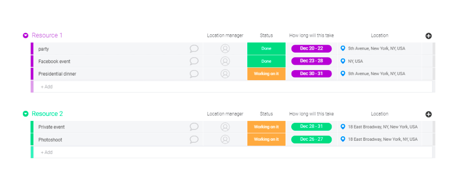
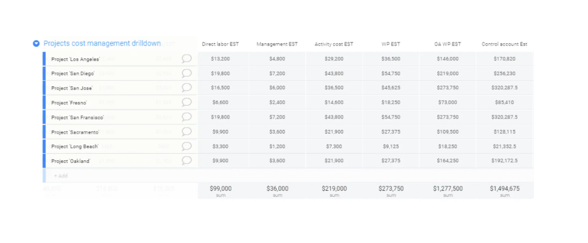
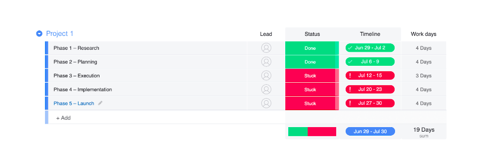
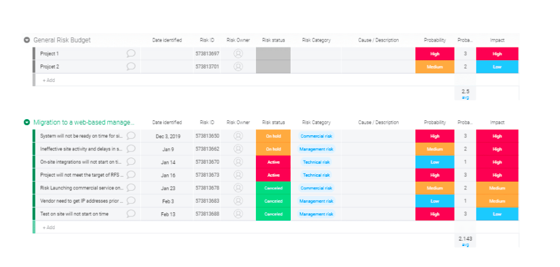

# 5 project planning templates to help you write a good project plan

### **1. Structure your project**
Looking for a general project plan template? Try one of our project plan templates.

Using some highly visual templates, you can structure your subprojects by set time periods and allocate accountable personnel to each phase.

Prioritize each project and add a timeline to show when deliverables are expected.

### **2. Plan out your resources**

Resource management is a breeze with some easy-to-use template.

eg:

Use this dashboard to organize all your project resources—from your technological tools to your specialist staff members.

You can allocate resources to individuals and tack on timescales so your staff knows what resources they’re responsible for in which phase. Adding a location makes it easy for teams to know where to hand over resources as they transition from one phase to the next—and they can check this on our mobile app.

### **3. Calculate your project budget**
It’s far easier to plan a budget when you can see all your costs in one place.

Add each subproject and plan out projected costs, allocating totals to each department. You can use the document to estimate the budget you’ll need and to record your approved project budget. You can then use our dashboards or reports to see the information in a different, more colorful way.

### **4. Sketch out your project schedule**

Plan out your schedules with some Project Timeline Template.

While this dashboard isn’t really suitable if you’re working with the Kanban framework, it’s ideal for those operating under Waterfall or Scrum frameworks.

For Waterfall projects, add in your milestones, attach a timeline, and allocate a set number of workdays to complete the tasks for each milestone.

Tag the team leader for each phase so project managers know which milestones they’re responsible for.

During project execution, teams can use the status bar to track progress. They can also add updates to each milestone by clicking on each item, which encourages inter-[team collaboration](../../agile/collaboration/README.md).

For Scrum projects, you can organize the dashboard by Sprints, adding in the specific tasks as they’re decided.

### **5. Work out potential project risks**

Visualize all your project scope and schedule risks with any Program Risk Register Templates.

There’s nothing better than a vivid color-coding system to highlight which items are a seriously risky business. Use color-coded status bars to illustrate risk status, risk probability, and risk impact for your project scope and schedule.

You can even categorize risks, add a risk owner, and suggest mitigation strategies. That way other project team members know what to do if these risks start to blossom into real glitches.

