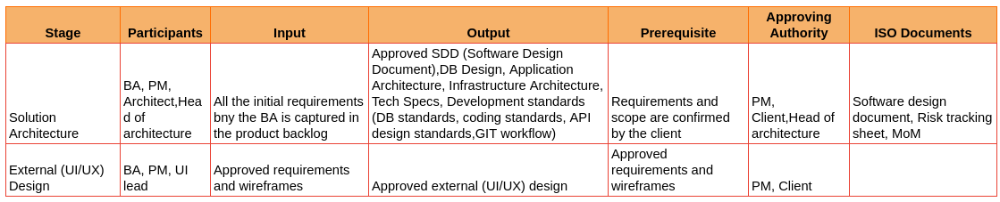
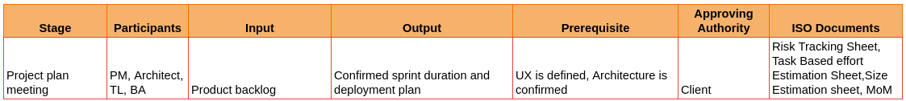
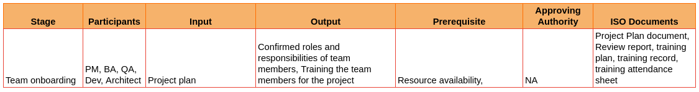
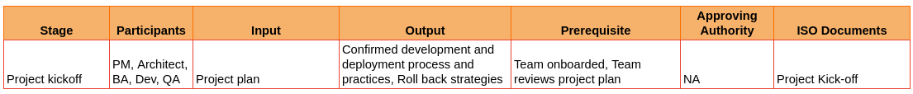
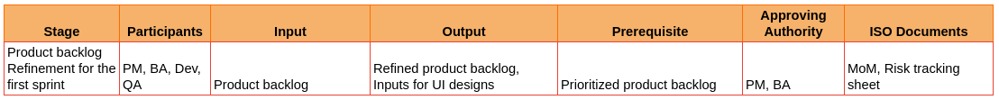
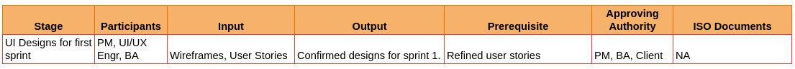
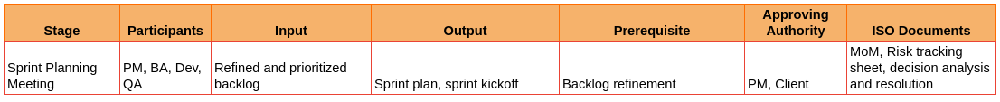

# II. Architecture Phase

**8. S/W Design (Solution Architect, BA, PM, UI Lead)**

a. Meeting between Architect, BA and PM to verify that all current requirements and further scope of the project are met in the architecture.

b. Architect must complete the solution architecture document and send it to the PM and Head of Architecture for approval.

c. PM will send the confirmed solution architecture document to the client for approval.

d. Confirm Solution Architecture Document with client and sign off the following:

       i. Tech Specification

      ii. Services utilized and their cost

     iii. Technical constraints

      iv. Application Architecture with sequence diagram

       v. Infrastructure architecture with diagram

      vi. Developer Reference

            a) API design standards

            b) General coding standards 

            c) Database design standards

            d) Git Workflow and branching

e. Finalize estimates with the PM and client with the proposed architecture.

   i. Finalize resource requirement and team structure

    ISO documents at stage 08

        - Software Design Document
        - Risk Tracking Sheet (update)
        - MoM of client call to discuss the proposed architecture.

**9. Project plan meeting - (PM, Architect, Team Lead and BA) - ideally within first 3 weeks of the project**

a. Define the team size

b. Estimate total efforts and days for each client requirement based on which the sprints and deployments are to be confirmed by the team

c. Define sprint duration and split requirements into sprints. Once confirmed, the duration of a sprint will not be changed throughout the project lifecycle.

d. Schedule the sprint ceremonies to be conducted within the confirmed sprint duration.

e. Strategic roadmap to be completed by the PM and shared with the architect, TL, core team, delivery head and the client.

    ISO documents at stage 09   

        - Risk Tracking Sheet (update)
        - Task Based Effort Estimation Sheet
        - Size Estimation sheet
        - MoM

**10. Onboarding project team (Maximum of 2 days)**

a. Assign roles for each team member including QA

b. All team members must study user stories

c. Start UI designs for the first sprint

d. Provide necessary project training for the dev team and QA

e. Project plan document is created by the PM and is shared with the team after the architect approves it. 

f. Each team member thoroughly studies the project plan document, and shares their feedback and doubts in the form of review reports.

g. The PM calls for a team meeting to discuss each of their review reports and clarify the doubts raised by the team.

    ISO Document  at stage 09

        - Project Plan Document
        - Review Report
        - Training Plan
        - Training Record
        - Training Attendance Sheet

**11. Project Kickoff (2 - 4 hour event)**

a. Confirm development process and practices with the team (sprint ceremonies, coding standards, approving authority)

b. Confirm date of first sprint

c. Confirm deployment plan and environments with the team

d. Roll-back strategies

    ISO Document  at stage 11

        - Project kick-off

**11. Pre-Sprint activities**

**11.1 Product Backlog Refinement for first sprint (4-6 hours)**

- BA to discuss each of the priority backlog items with the dev team 

- Team to finalize on the use cases, technical cases and UI, dev and QA tasks regarding each of the backlog items in discussion.

- QA to highlight the test scenarios related to each backlog item in discussion.

- Effort estimation to be confirmed by the team for each of the backlog items in discussion.

- This meeting can be conducted in a single day or across multiple days.

- By the end of the refinement, there must be clarity about backlog items in discussion, including inputs for UI designs for the first sprint.

    ISO Document  at stage 11.1

        - MoM
        - Risk tracking sheet

**11.2 UI Designs for first sprint**

- PM assigns UI tasks of the first sprint to the UI/UX engineer.

- UI/UX Engineer starts the designs for the first sprint of the project based on the inputs from the BA.

- Following inputs to be provided by the BA:

  - Wireframes

  - User story with error conditions

- Completed designs are submitted for BA review through the PM

- Designs to be reviewed and confirmed by the BA

- Designs confirmed by the BA are submitted for client approval

*ISO Document  at stage 11.2* (Not identified)

**12. Sprint Cycle (considering 2 weeks)**

**12. 1 Sprint planning meeting and Sprint Kickoff (2 Hours)**

a. Sprint planning is conducted by the PM with the whole team (BA, Dev including TL, QA)

b. The backlog items which were refined during the backlog refinement will be added to the sprint according to the effort estimation and team velocity.

c. Task assignment 

d. Decision on task completion dates

e. Decision on deployment date, if applicable to the sprint.

f. Official kickoff of the sprint with the confirmed duration.

    ISO Document  at stage 12 

        - MoM
        - Risk tracking sheet
        - Decision Analysis and Resolution

**12.2 UI Designs (UI/UX Engr, BA)**

a. Completion of UI designs for the current sprint if any

         i) Resolutions - 360, 768, 1024, 1440
        ii) Animations, if required
       iii) Design & Prototype (if required)

b. UI Designs for the next sprint (Follow the process of **11.2**)
