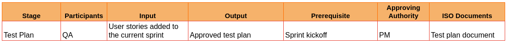
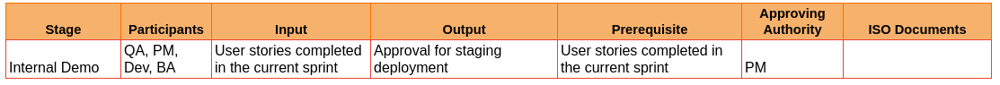

# IV. QA Phase (to run in parallel to the Dev phase)

**12.5 Test Plan (QA)**

Estimated Time - 2 Hours 

- A detailed document that outlines the test strategy, objectives, schedule, estimation, deliverables, and resources needed to undertake software product testing for that particular sprint.

- Test planning is done right after sprint kickoff.

- The test plan document consists of the following: 

  * in-scope items (including test environments and test devices)

  * out-of-scope items and 

  * Entry-exit criteria: Entry and exit criteria are the requirements which must be met before and after a specific process.

- This test plan document is to be approved by the PM before starting test cases

  ISO Document  at stage 12.5
  
    - Test plan document - QA

**12.6 Test Case Design, Creation and Approval (QA, BA)**

Estimated Time - 25 Hours for a sprint

- Creates test cases by analyzing the requirements.

- Identification of smoke, regression and negative scenarios.

- Detailed test cases and test scenarios are prepared for both functionality and user experience aspects for the user stories included in the current sprint.

- The test case document has to be reviewed and approved by the BA in conformation with the edge cases and test case coverage.

  ISO Document  at stage 12.6 

    - Test Case document - QA

**12.7 Unit Testing using QA Test Cases (Dev)**

Estimated Time - 4 Hours

- The PM shares the approved test cases with the dev team before the completion of dev.

- Each developer unit tests his/her own output using the approved test cases.

- The developer clears any issues found during unit tests and submits PR. 

*ISO Document  at stage 12.7 (Not identified)*

**12.8 Deployment to QA env** 

- The TL merges the pull requests after review

- The latest updates will be pushed to the QA env and TL confirms the same with the team.

**Environment: QA**

**12.9 Smoke Test (QA)**

Estimated Time - 30 Minutes

- QA performs smoke tests on the deployed updates and determines whether or not the deployed build is stable. 

- If any blocker issues are caught in smoke testing, the dev team will be informed after bug creation in the PM tool.

- The dev team fixes the blocker issues on priority and submits PR 

- TL deploys the PR to the QA server once again for bug retest.

- The QA performs a smoke test to ensure the update is stable.

**12.10 Functional Test (QA)** 

Estimated Time -  24 Hours

- QA tests the basic functionality, negative cases and edge cases of the build thoroughly.

- Bugs are raised in the PM tool in the following format:

    * Description of bug 
    * Criticality
    * Steps to Reproduce
    * Actual Result
    * Expected Result

- The TL will assign bugs to the corresponding developer based on the priority. If the TL is unsure, he/she can confirm the priority with the PM.

- The developer will fix the bug and submit PR after their unit test.

- TL deploys the PR to the QA server once again for bug retest.

  ISO Document  at stage 12.10

    - Test case and results

**12.11 Integration Testing** (QA, TL, PM)

Estimated Time 8 Hours

- The QA tests whether the updated components and system interfaces work together. 

- Bugs are raised in the PM tool in the following format:

    * Description of bug
    * Criticality 
    * Steps to Reproduce
    * Actual Result 
    * Expected Result

- The TL will assign bugs to the corresponding developer based on the priority. If the TL is unsure, he/she can confirm the priority with the PM.

- The developer will fix the bug and submit PR after the unit test.

- TL deploys the PR to the QA server once again for bug retest.

- Integration and functional testing run in parallel.

  ISO Document  at stage 12.11

    - Test case and results

**12.12 Regression Testing** (QA, BA, TL, PM)

Estimated Time 8 Hours

- The QA tests to ensure that a recent update hasn't harmed existing functionality and is working properly.

- Regression tests are done based on the regression suite created by the QA and BA. 

- Bugs are raised in the PM tool in the following format:

    * Description of bug
    * Criticality
    * Steps to Reproduce
    * Actual Result
    * Expected Result

- The TL will assign bugs to the corresponding developer based on the priority. If the TL is unsure, he/she can confirm the priority with the PM.

- The developer will fix the bug and submit PR after the unit test.

- TL deploys the PR to the QA server once again for bug retest.

  ISO Document  at stage 12.12

    - Test case and results

**12.13 Bug Retesting and Sign off** (QA, Dev, PM)

- The QA retests the bug tickets which are redeployed after bug fixes. 

- The QA conducts integration testing along with a retest if needed based on the bug.

- If bugs are found in this stage, the cycle of bug creation, bug fixes, QA deployments and retests repeat. 

- Once all bugs as per priority are found to be cleared, the QA signs off to the PM for staging deployment.

  ISO Document  at stage 12.13

    - Test case and results

**12.14 Internal Demo** (QA, PM, Dev, BA)

- QA performs the demo of the features completed in the current sprint to PM and BA along with the Dev team.

- If any bugs are discovered during the demo they shall be fixed in the QA environment and submitted for retest.

- Multiple internal demos could be conducted during a sprint as per the discretion of the PM.

*ISO Document  at stage 12.14*(Not Confirmed)
