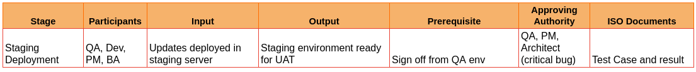
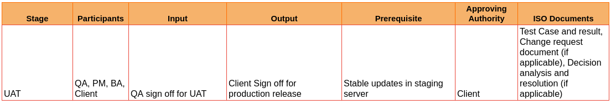
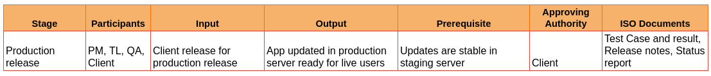

# V. Deployment Phase

**Environment: Staging/UAT**

**12.14 Staging Deployment & Testing** (QA, Dev, PM, BA, Architect (critical bug))

Estimated Time 8 Hours (If Applicable to the project)

- Staging environment is a replication of the production environment. 

- The updates signed off by the QA in the QA env are deployed to the staging server by the TL.

- On completion of staging deployment, the TL notifies the same to the QA and the PM.

- In this environment, functional, integration, and regression tests are performed. 

- If bugs are found in this stage:

    * Criticality: Low to High - the cycle of bug creation, bug fixes in dev env, followed by QA deployment and retests repeat.

    * Criticality (Blocker issue) Highest - the bug has to be fixed in the staging environment with the approval of the PM and architect. This is retested in the same environment by the QA.
  
- Once the QA confirms that the staging is stable, the BA runs a UAT in the staging environment.

    ISO Document  at stage 12.14

        - Test case and results

**12.15 Backlog Refinement for next sprint**

Please follow steps as in Section **11.1** **Product Backlog Refinement**

**12.16 UI Designs for next sprint**

Please follow steps as in Section **11.2** **UI Designs for first sprint**

**12.17 UAT** (QA, PM, BA, Client)

- User Acceptance Testing has to be performed by the QA, BA, PM and the client in the staging environment. 

- Issues found follow the cycle of bug creation, bug fixes in dev env, followed by QA deployment and retests repeat. 

  - Retests of the bugs found in this stage have to be signed-off by only the QA.

- Once the QA confirms that the staging has passed UAT, the PM is notified and he/she informs the client that the updates are ready for client UAT.

- The client performs UAT and one of the following happens:

    i. The client raises an issue which is a change request

       - The BA confirms with the client that the issue is a change request and schedules the request for future iterations.

       - The same will be updated as a product backlog item for future sprint.

    ii. The client raises an issue which is a bug or missed requirement-

       - The BA negotiates with the client to confirm the criticality of the issue. 

       - Critical issues: need to be addressed at the earliest and redeployed for client confirmation. 

       - Non-critical issues can be addressed in a future sprint with the confirmation of the client. The cycle of bug creation, bug fixes in dev env, followed by QA deployment and retests repeat.

    iii. UAT Passed- The client signs off for production release after they perform UAT.

    ISO Document  at stage 12.17

        - Test case and results
        - Change request document (if applicable)
        - Decision analysis and resolution (if applicable)

**12.18 Production Deployment/Release**(PM, TL, QA)

- PM approves for production deployment.

- TL completes the production deployment from the staging server and notifies the team.

- TL creates a pre-production snapshot of the latest production server.

- QA runs a smoke test in the production server

    1. Smoke test fails: Issue will be fixed in staging server, retested and redeployed to production, followed by a retest in production.
  
    2. Smoke test passes: QA confirms the production server as stable.

- PM confirms the release with the client.

- Ideally, this marks the completion of a sprint.

    ISO Document  at stage 12.18

        - Test case result
        - Release notes
        - Status report
