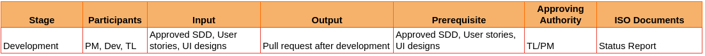
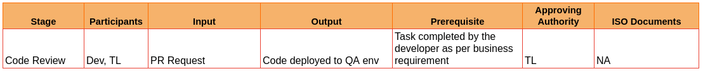

# III. Development Phase

**Environment: Dev**

**12.3 Development (Dev team, TL, PM, Solution Architect)**

a. PM to conduct daily scrum meeting and task assignment

      i) The duration of scrum meeting must not exceed 15-20 mins
     ii) Each developer updates their status in the format 
        - What I did yesterday.
        - What I plan to do today.
        - Blockers, if any.
    iii) Any technical discussions are to be conducted as separate meetings between the concerned parties outside the scrum.
b. Project Monitoring

    i) PM to track the progress of the project daily to avoid blockers and delay

c. Weekly status reports by the PM to the delivery manager and clients (Project status)

d. Developers complete the tasks, complete unit testing using QA test cases (refer 12.7) and raise a pull request (PR).

e. Developers to maintain Tech-spec document

    ISO Document  at stage 12.3

        - Status Report

**12.4 Code Review (TL, Dev)**

- The PR submitted by each developer will be reviewed by either the TL or another team member, as decided by the architect.

- Review comments may be added by the reviewer, which then should be corrected and resubmitted by the developer.

- TL/peer team members will approve the PR after verifying the above step. 

- Approved pull requests will be merged and deployed to the QA environment with the confirmation from TL.

*ISO Document  at stage 12.4* (Not identified)

