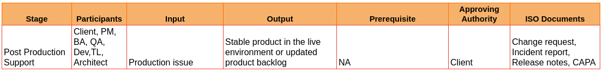
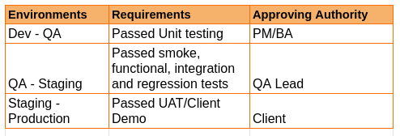

# VI. Post Production

**13. Post-Production Support** 

- Client raises a critical production issue to the PM.

- PM, BA and TL gauge the criticality and impact of the issue.

- The issue could be categorized into either of the following:

    - Feature bug
        - BA negotiates with the client on the criticality of the bug.
        - Top priority issues will be reproduced by the team, fixed in dev env, tested, deployed in staging env retested and then deployed to production.
        - Non-critical issues could be added to the backlog as a future update with the confirmation of the client.
    - Technical, Deployment or high impact issue
        - Dev team fixes the issues in production 
        - TL creates an incident report and submits it to the PM and architect.
        - The PM confirms with the client that the issue is fixed and submits the incident report to the client and the delivery head.

    ISO Document  at stage 12.13

        - Change request
        - Incident report
        - Corrective and Preventive Action
        - Release notes

**14. Project Closure**

A consolidated project summary will be listed.

PS: 	

\*this doc will be supported by a detailed flowchart

**15. Deployment Management**

- The goal of deployment management is to get feature updates into live environments. It may also be involved in deploying components to test or staging environments.

- The following table shows the different environment switchings, with the requirements to be met for it, along with the approving authorities.

