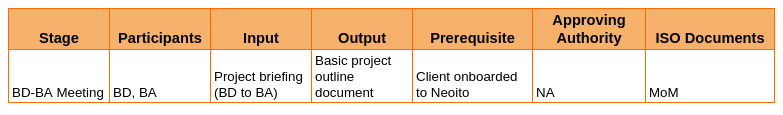
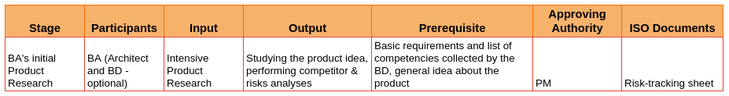
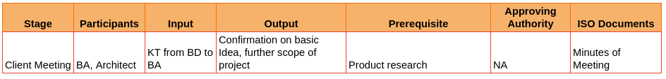
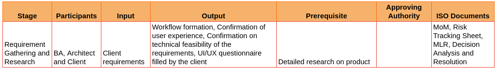
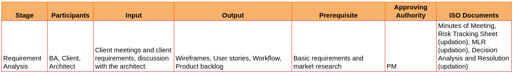
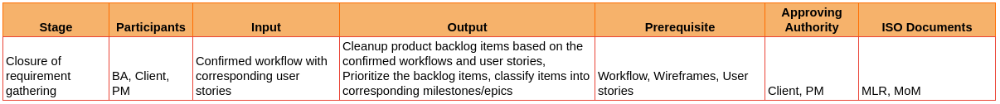
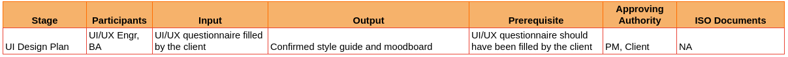

# I. Requirement Phase

**1. BD to BA communication (at least 2 days before BA’s engagement with client)**

a. Project briefing (Discussion of basic project understanding and client expectation between BD and BA)

b. BD to share project related documents to BA

   *  Basic requirement list (BD team already has this with them)

   *  List of competitions existing in the market, if any. 

**2. BA’s Initial Product research (at least 1 day before the first client call)**

a. Study of product idea

   * Competitor analysis
   * Risk analysis

b. Sync with the Architect/Account manager if the architect is present in the first client meeting.

   * Meeting between BA and Architect and BA must share initial study documents from BD to the architect (at least 4 hours before the client call)

c. The PM will be onboarded to the team.

**3. Client Meeting (BA, Architect** (will be present as needed)**)**

a. Introduction

b. Confirm basic project idea as discussed with BD

c. Discuss further project details with client (client’s explanation)

***Points to consider and defined in client call:***

    a. Necessity of the product

    b. Targeted audience

    c. What do we wish to convey to the target market?

    d. What is the USP of the app?

    e. Desired device compatibility 

*NB : Research on transcription tools that can be used to generate MoM*

     ISO Documents in phase 03:

    *  Minutes of Meeting

**4. Requirement Gathering and Research (BA, Client, Architect) (ideally within first 2 weeks of the project)**

a. Client meetings must be conducted frequently during the requirement gathering phase for understanding requirements, gather clarifications, and start forming the workflows

b. Research by BA : 

   *  Check if similar projects has been done in NeoITO (Project Library to be kept by architects and BAs)

   *  To make better suggestions and alternatives

   *  Identifying and understanding risks

c. BA to have constant meeting with UI/UX lead to set the UX 

   *  To get confirmation from UI/UX lead on the User Experience of the workflows.

   *  BA must get the UX questionnaire filled/confirmed by the client

d. Technical suggestions and confirmation from the Solution Architect.

e. Regular discussions with solution architects regarding the requirements and findings of BA for better technical solutions and check technical feasibility of the requirements.

f. *In case of existing product* - Need to prepare system study document (by BA and Architect) [*System Study Document* (in case of existing system)]

    ISO document for phase 04:

        - Minutes of Meeting
        - Risk Tracking Sheet (start)
        - MLR
        - Decision Analysis and Resolution (start)

**5. Requirement Analysis (BA, Client) (ideally within first 2 weeks of the project)**

a. Research by BA :

b. Wireframes to be done

   * Update the project library of all the projects Neoito worked on

c. Gather Requirements as User Stories

   * Story Explanation

   * Actors in the story

   * Validation Criteria

   * Attach wireframes along with user story

d. Update user stories as product backlog items in PM tool

e. Regularly communicate user stories with Solution Architect to set the architecture based on detailed requirements.

f. Regular update calls and confirmation with clients on the proposed workflow.

    ISO documents to start at stage 05

    - Minutes of Meeting
    - Risk Tracking Sheet (updation)
    - MLR (updation)
    - Decision Analysis and Resolution (updation)

**6. Closure of initial Requirement Gathering (ideally within first 2 weeks of the project)**

a. Submit to client all Wireframes and workflow diagrams in google drive

b. PM to be introduced to the client

c. BA must share with PM all wireframes and workflow diagrams

d. BA must share with Architect all wireframes and workflow diagrams

e. Product backlog must be updated in the PM tool for the initial scope of the project.

f. Signoff ISO documents with client

   * MLR

   * Minutes of Meeting (MoM)

**7. UI Design Plan (BA, UI/UX Engineer) (ideally within first 2 weeks of the project)**

a. Moodboard is used to set out the look and feel of the UI design. 

b. Style guide and components - It helps define elements like typography, colors, layout, and components that are to be used in accordance with the proposed user experience.

