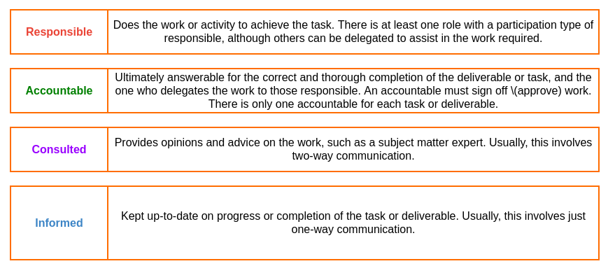
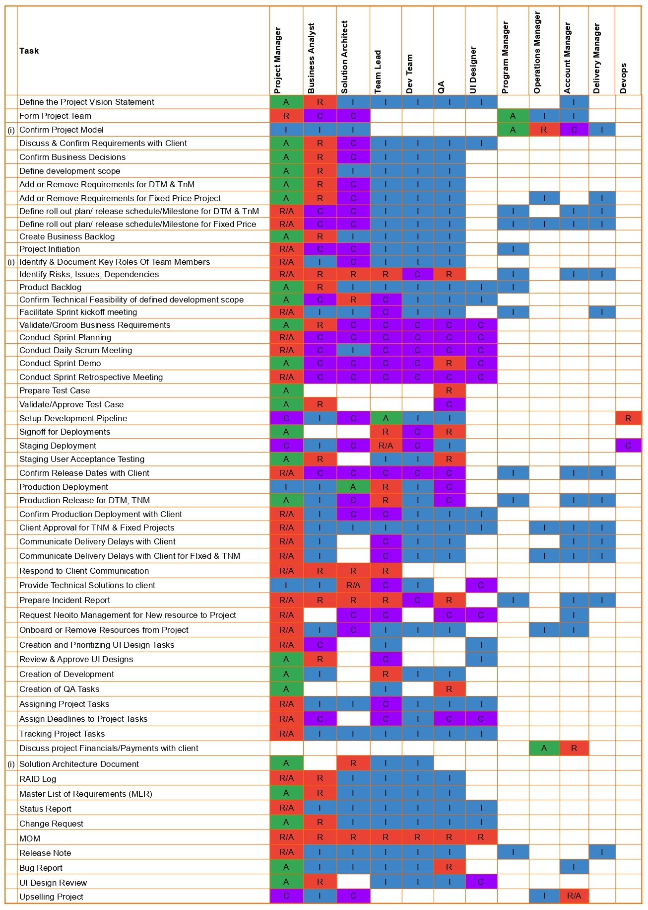

# RACI Matrix

To ensure collaboration and project success, it is crucial for all project stakeholders to understand their roles and responsibilities and those of other project members. This is especially important when project teams are more complex due to their large size, involvement of distributed team members, or reliance on staff from multiple departments. 

RACI stands for Responsible Accountable Consulted Informed. While its origins are murky, the RACI matrix has been adopted by many organizations to associate roles with project deliverables. One Six Sigma tutorial describes RACI this way:

“Typically a task is associated with at least one role or in some cases multiple roles. This ‘Association’ of the role with a task can be divided into the following four association types:

* Responsible
* Accountable
* Consulted
* Informed

The above four types of association of a role to a task represented in a simple task vs. role diagram or matrix is called RACI (pronounced ‘racey’) matrix. So basically the RACI matrix is a responsibility assignment matrix (RAM), designed to assign tasks, activities, responsibilities, accountability, decision making, support to team members of a process/project, and clarify expectations on the level of their participation.” Here is the RACI matrix of NeoITO:

