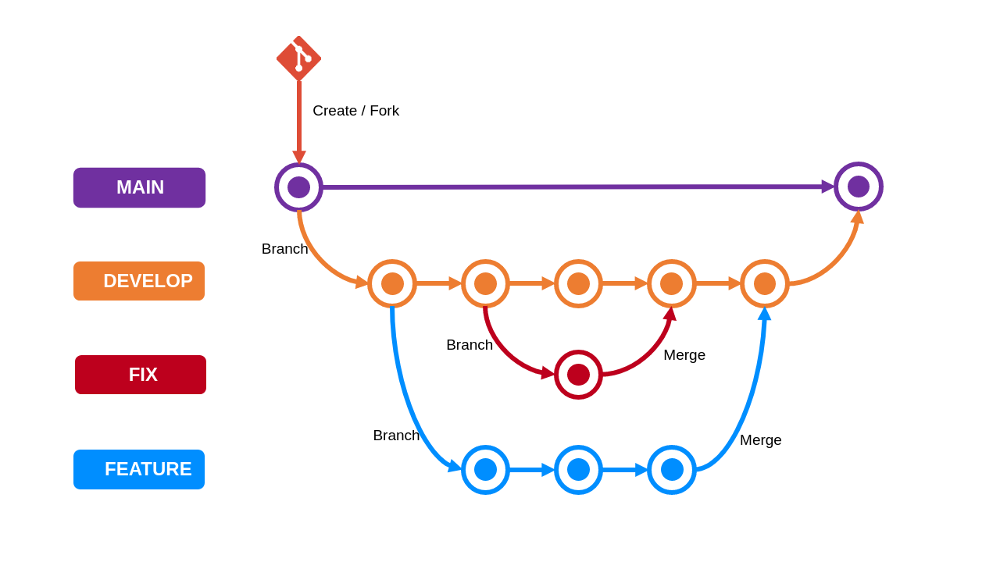

# Git Process

While creating a version control system, it needs to follow certain process to maintain smooth workflow and for easy maintanence.

A project will mainly have four branches

- Main
- Develop
- Feature
- Fix/HotFix

We also have a **QA** branch for the Quality Analyst to run automation and manual test cases.

## Main

THe main branch is used as the production branch where the code is tested by the QA and all the features will be working without any fail.
This branch holds the stable code.
A PR/MR to the main branch is done when all the test cases are successfully completed and QA approves it.

## Develop

The develop branch is used by developers for developing new features and for doing hotfixes.

The develop branch holds the latest code which won't be stable.It is used as a dev environment where developers can test their features.

## Feature

While developing a new feature developers will create feature branches from develop branch.
This branch is maintained by the developer who is assigned to the task and will develop the new feature in this branch.

The developer should run test cases on this branch and when everything looks good they can create a Pull Request to the parent develop branch.
Each feature branch holds only a particular feature.

Before creating a PR to the develop branch the developer should take Pull from parent branch and ahould resolve conflicts if any.

## Fix

This is a hot fix branch created when the dev environment goes down due to a latest merge.
So a hotfix is created to fix the problem.

This hotfix should happen immediate inorder to make the develop branch back to working asap.

## QA

A QA branch is cerated for the QA engineers to run autaomation testing.
The QA is the parent branch for develop.
After everything is okay with develop, a PR is created to QA branch for the testers.
WHen QA creates an issue, a Hot fix or a feature branch is created to fix the issue.
