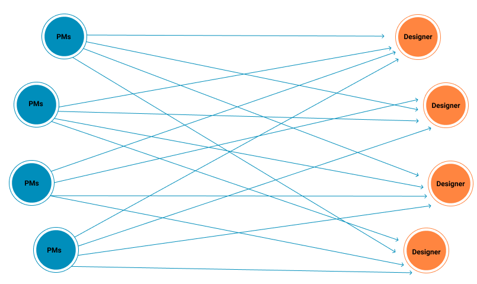
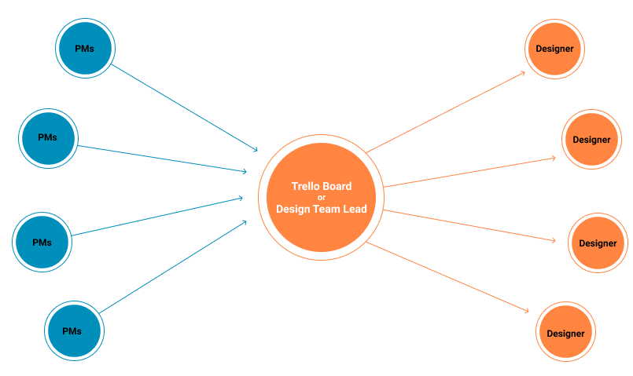

# Designing Team Practice & Process Flow

## Problem

The issue that existed was the designers were approached directly by project PMs and developers directly for their work-related designs. This used to cause a confusion within the organisation with respect to designs and severely affected the timeline for the designs of Client projects.
To solve these issues, a new process has been put in place where in the individual designers won’t be contacted directly by any PMs or developers. Also to improve design quality all the designs will be vetted before given to the projects.

## Solution

All the PMs or developers will post their design requirement in a centralised Trello board or inform design Team Lead (Chandu) who will update these tasks to Trello board.
The task list created on trello will be then further assigned to different designers by the team lead.
By EOD all the tasks are to be checked for quality by Design Quality Lead (Abhilash) before being passed to the team. 
In case of any quality issues or designs not meeting expectations of PMs or designers the same designs have to be updated as per requirement and given to the team on the same day itself.

> **_NOTE:_**  existing project-designer relation to be maintained as much as possible to maintain the continuity of flow.